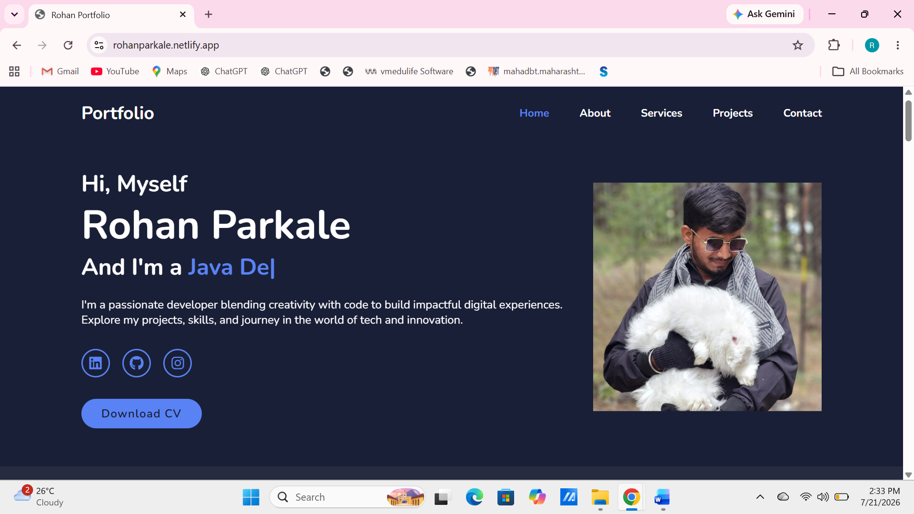
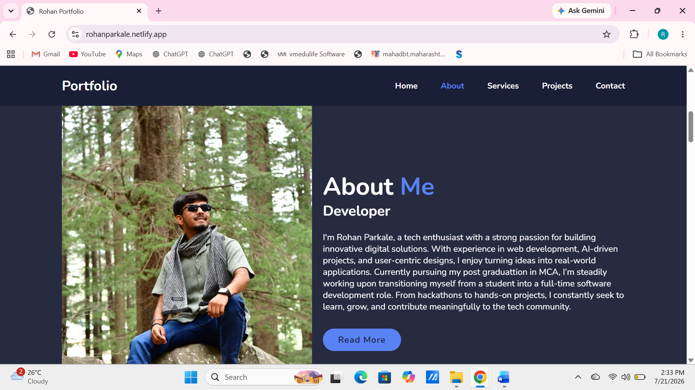
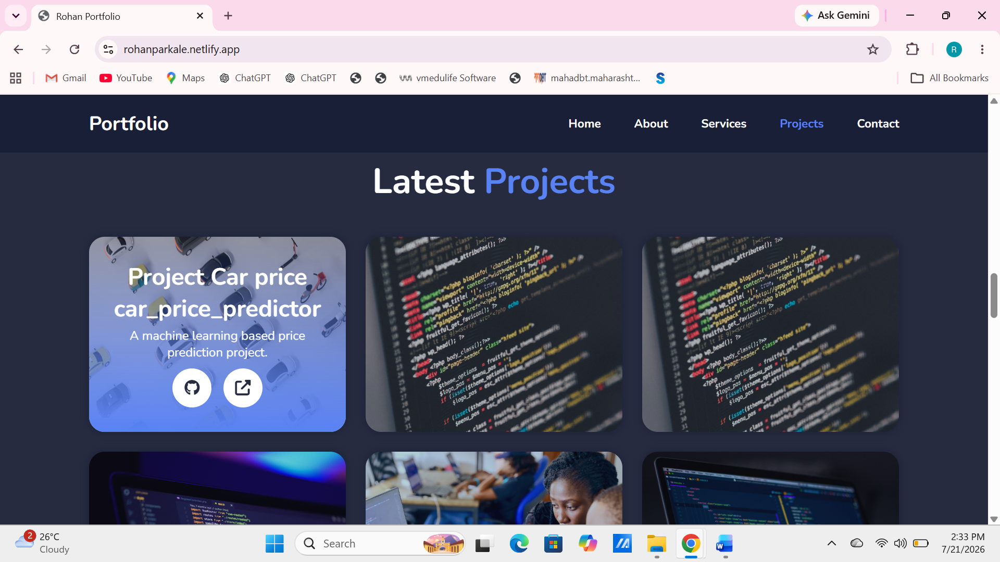

# 🌐 Personal Portfolio Website

Welcome to my personal portfolio repository!

This portfolio showcases my technical skills, projects, education, and professional journey as an MCA student and aspiring Software Developer. It serves as a central place for recruiters, developers, and collaborators to explore my work and achievements.

---

# 🚀 Live Demo

🌍 **Portfolio Website**

https://parkalerb.github.io/portfolio

---

# 📖 About

This portfolio has been designed to present my professional profile in a clean and responsive way.

It highlights:

- 👨 About Me
- 💻 Technical Skills
- 🚀 Featured Projects
- 🎓 Education & Experience
- 📜 Certifications
- 📞 Contact Information

The website is fully responsive and works across desktop, tablet, and mobile devices.

---

# 📸 Portfolio Preview

## 🏠 Home Page

<p align="center">
    
</p>

The landing page introduces my profile, technical interests, and provides quick access to my resume and social profiles.

---

## 👨‍💻 About Me

<p align="center">
    
</p>

This section introduces my educational background, career goals, and passion for Software Development and Machine Learning.

---

## 🎓 Education & Experience

<p align="center">
    
</p>

Displays my academic journey and learning timeline.

---

## 💼 Featured Projects

<p align="center">
    
</p>

Highlights my major software development and Machine Learning projects.

---

# ✨ Features

- Responsive Design
- Modern User Interface
- Smooth Navigation
- Project Showcase
- Skills Section
- About Me
- Education Timeline
- Contact Section
- Resume Download
- GitHub & LinkedIn Integration

---

# 🛠️ Tech Stack

## Frontend

- HTML5
- CSS3
- JavaScript

## Development Tools

- Git
- GitHub
- Visual Studio Code

## Deployment

- GitHub Pages
- Netlify

---

# 📂 Project Structure

```text
portfolio/
│
├── assets/
├── css/
├── images/
│   ├── home.png
│   ├── about.png
│   ├── education.png
│   └── projects.png
│
├── js/
├── index.html
└── README.md
```

---

# 💼 Featured Projects

### 🚦 Smart Traffic Management System

AI-powered Smart Traffic Management System using Flask, MySQL, OpenCV, and Computer Vision.

---

### 🤖 Hand Gesture Recognition

Machine Learning project that detects hand gestures using Python and OpenCV.

---

### 🚗 Car Price Prediction

Machine Learning project for predicting used car prices using regression algorithms.

---

### 🎫 Online Ticketing Chatbot

A chatbot application developed to simplify the online ticket booking process.

---

# 💻 Technical Skills

### Programming Languages

- Python
- Java
- C

### Web Development

- HTML
- CSS
- JavaScript

### Backend

- Flask
- FastAPI

### Database

- MySQL
- Oracle

### Tools

- Git
- GitHub
- VS Code
- Postman
- Linux

---

# 🚀 Run Locally

```bash
git clone https://github.com/parkalerb/portfolio.git
```

Open

```text
index.html
```

in your preferred web browser.

---

# 📬 Contact

📧 **Email**

rohanparkale1234@gmail.com

💼 **LinkedIn**

https://www.linkedin.com/in/rohan-parkale

💻 **GitHub**

https://github.com/parkalerb

🌐 **Portfolio**

https://parkalerb.github.io/portfolio

---

# 🚀 Future Improvements

- Dark Mode
- Blog Section
- Project Filtering
- Visitor Analytics
- Backend Contact Form
- More Interactive Animations

---

# 👨‍💻 Author

**Rohan Parkale**

- MCA Student
- Aspiring Software Developer
- Passionate about Python, Machine Learning, and Full-Stack Development

---

⭐ **This repository represents my professional portfolio, showcasing my projects, technical skills, and continuous learning journey.**
